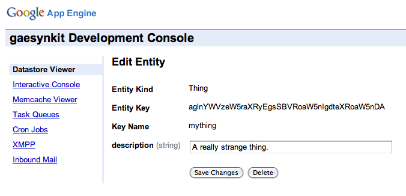

.. gaesynkit documentation.

=============
Documentation
=============

This document tries to introduce the concepts behind the gaesynkit Client
Storage API and explains common use-cases with code examples.

Overview
--------

The gaesynkit library provides an API to create entities and synchronize data
between the HTML5 `Web Storage <http://dev.w3.org/html5/webstorage>`_ and the
Google App Engine Datastore.

Storing Entities
----------------

The gaesynkit Client Storage API is mostly designed after the low-level GAE
Datastore API. The following sample shows how to create, put and get an entity
with Javascript::

  var entity, db, key

  entity = new gaesynkit.db.Entity("Person");

  entity.update({"name": "John Dowe", "age": 42});

  db = new gaesynkit.db.Storage;

  key = db.put(entity);

  entity = db.get(key);

  entity["name"]; // -> "John Dowe"

The equivalent GAE Python API looks like this::

  from google.appengine.api import datastore

  entity = datastore.Entity("Person")

  entity.update({"name": "John Dowe", "age": 42})

  key = datastore.Put(entity)

  entity = datastore.Get(key)

  entity["name"] # -> "John Dowe"

Nearly identical, isn't it. In order to understand how we store entities, let's
now take a quick look at some lower level details of the GAE Datastore.

Unlike a relational database, Google App Engine implements a `schemaless`
Datastore that stores and performs queries over data objects, known as
entities, which have one or more properties. The following example shows the
dumped output of the `Protocol Buffers` encoded entity::

  key <
    app: "test"
    path <
      Element {
        type: "Person"
        id: 3
      }
    >
  >
  entity_group <
    Element {
      type: "Person"
      id: 3
    }
  >
  property <
    name: "age"
    value <
      int64Value: 42
    >
    multiple: false
  >
  property <
    name: "name"
    value <
      stringValue: "John Dowe"
    >
    multiple: false
  >

We use JSON to represent and store the above entity in our web client::

  {
    "kind": "Person",
    "key": "ZGVmYXVsdCEhUGVyc29uCjE=",
    "id": 3,
    "properties": {
      "name": {"type":"string","value":"John Dowe"},
      "age": {"type":"int","value":42}
    }
  }

Property Value Types
--------------------

Property values are normalized. Most of the types are based on XML elements
from Atom and GData elements from the atom and gd namespaces. For more
information, see:

 * http://www.atomenabled.org/developers/syndication/
 * http://code.google.com/apis/gdata/common-elements.html

The namespace schemas are:

 * http://www.w3.org/2005/Atom
 * http://schemas.google.com/g/2005

The following example instantiates a
:class:`google.appengine.api.datastore.Entity` which stores one of each
available property values::

  from datetime import datetime
  from google.appengine.api import blobstore
  from google.appengine.api import datastore
  from google.appengine.api import datastore_types
  from google.appengine.api import users
  from google.appengine.ext import db

  entity = datastore.Entity("Test")

  entity.update({
    "string": "A string.",
    "byte_string": datastore_types.ByteString("Byte String"),
    "boolean": True,
    "int": 42,
    "float": 1.82,
    "date": datetime.now(),
    "list": [1,2,3,4],
    "key": db.Key.from_path("Kind", "name"),
    "blob_key": blobstore.BlobKey("foobar"),
    "user": users.User("test@example.com"),
    "blob": db.Blob("foobar"),
    "text": db.Text("foobar"),
    "category": db.Category("category"),
    "link": db.Link("http://www.apple.com"),
    "email": db.Email("test@example.com"),
    "geopt": db.GeoPt("52.518,13.408"),
    "im": db.IM("http://example.com/", "Larry97"),
    "phone": db.PhoneNumber("1 (206) 555-1212"),
    "address": db.PostalAddress("1 Infinite Loop, Cupertino, CA"),
    "rating": db.Rating(97)
  })

The Client Storage API transparently translates properties to equivalent
Javascript types or classes. Let's take a look at the JSON representation to
get a feeling how property types are stored::

  {
    "kind": "Test",
    "key": "Z2Flc3lua2l0QGRlZmF1bHQhIVRlc3QKMQ==",
    "version": 0,
    "id": 1,
    "properties": {
      "string": {"type": "string", "value": "A string."},
      "boolean": {"type": "bool", "value": true},
      "int": {"type": "int", "value": 42},
      "float": {"type": "float", "value": 1.82},
      ...
    }
  }

Here is the :js:class:`gaesynkit.db.Entity` instance as shown by the Chrome
Developer Tools::

  gaesynkit.db.Entity
    _key: gaesynkit.db.Key
    _properties: Object
      boolean: gaesynkit.db.Bool
        _type: "bool"
        _value: true
        __proto__: gaesynkit.db.ValueType
      float: gaesynkit.db.Float
        _type: "float"
        _value: 1.82
        __proto__: gaesynkit.db.ValueType
      int: gaesynkit.db.Integer
        _type: "int"
        _value: 42
        __proto__: gaesynkit.db.ValueType
      string: gaesynkit.db.ValueType
        _type: undefined
        _value: "A string."
        __proto__: Object
      __proto__: Object
    _version: 0
    boolean: —
    float: —
    int: —
    string: —
    __proto__: Object

Ancestor Relationship
---------------------

Each :js:class:`gaesynkit.db.Key` instance holds a *path*. The path is a
sequence of kind and id/name pairs where the key of the original entity is the
last path element. All other path elements are the ancestors where the first
one is the root entity.

The following example shows how to create a *one-to-many* relationship by
specifying a parent key::

  var author = new gaesynkit.db.Entity("Author", "dadams");

  author.update({"name": "Douglas Adams"});

  var db = new gaesynkit.db.Storage;

  db.put(author);

  var book = new gaesynkit.db.Entity("Book", null, null, author.key());

  book.update({"title": "The Hitchhiker's Guide to the Galaxy"});

  db.put(book);

We can easily retrieve the parent key::

  book.key.parent();

Client-Server Communication
---------------------------

The gaesynkit framework uses `JSON-RPC 2.0
<http://groups.google.com/group/json-rpc/web/json-rpc-1-2-proposal>`_ for
client-server communication.

Synchronization
---------------

The Client Storage API allows for synchronizing entities between HTML5 `Web
Storage <http://dev.w3.org/html5/webstorage>`_ and the server-side Datastore.
Therefore, the Python API of :py:mod:`gaesynkit` provides the necessary
facilities such as a webapp based synchronization request handler and a
:py:class:`SyncInfo` model. The :py:class:`gaesynkit.sync.SyncInfo` is
basically a wrapper class for entities which holds the synchronization status
of a user's entity. So, there is no need for changing any model of the user's
application.

These are the parts, but how does synchronization work? Before going into
detail here is a simple code snippet. First, we create an entity::

  var db, entity, key;

  db = new gaesynkit.db.Storage;

  entity = new gaesynkit.db.Entity("Thing", "mything");

  entity.update({"description": "A really strange thing."});

The :js:func:`gaesynkit.db.Storage.put` method puts the entity into the local
storage of the web client::

  key = db.put(entity);

And the :js:func:`gaesynkit.db.Storage.sync` method submits the entity to the
GAE server application for synchronization::

  entity = db.sync(key);

After synchronizing, the entity has a new version::

  entity.version();

Let's make sure that our entity is correctly stored to the GAE Datastore by
accessing the admin Datastore Viewer.

At the same time, our entity is stored in the client's local storage as a JSON
string::

  {
    "kind": "Thing",
    "key": "Z2Flc3lua2l0QGRlZmF1bHQhIVRoaW5nCG15dGhpbmc=",
    "version": 1,
    "name": "mything",
    "properties": {
      "description": {"type":"string","value":"A really strange thing."}
    }
  }

For keeping track of synchronized entities the server-side Datastore stores a
:py:class:`gaesynkit.sync.SyncInfo` entity which points to a particular entity
and holds information such as the current version and a md5 content hash.

Security
--------

Since the Client Storage API provides a rich interface to modify data in the
Datastore of an application, authentication is particularly challenging. The
current implementation uses a fairly straightforward approach where each
:py:class:`gaesynkit.sync.SyncInfo` entity is owned by a distinct user. For
now, only this user is allowd to synchronize the related entity.
